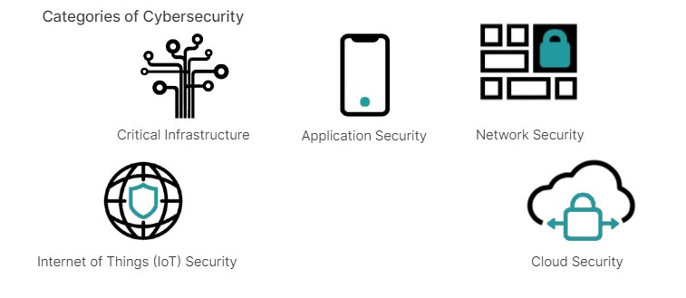
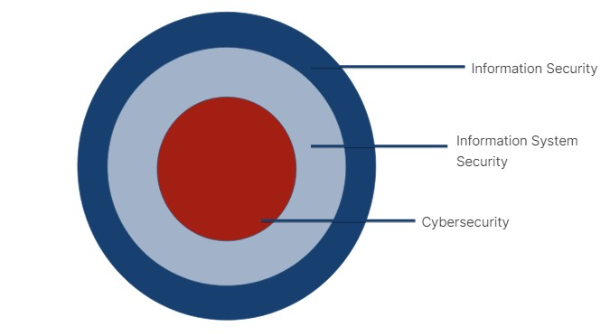
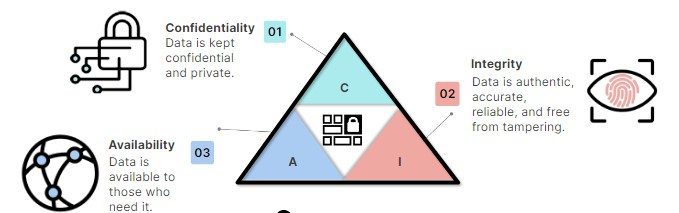
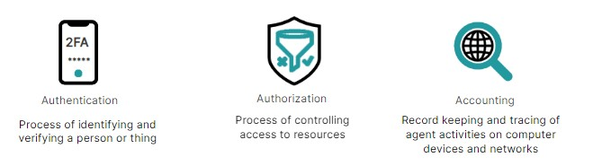

## What is cybersecurity?

- It's a collective method, technology, and process that protects computer systems, networks, and the information they contain.
- It is the practice of protecting computer networks, devices, and information from damage, loss, or unauthorized access.
- Its primary goal is to protect digital information from threats.

## Categories of cybersecurity:

- These different categories reflect the extent of Information security (InfoSec).
- InfoSec is the practice of protecting information, including digital and physical assets, and involves tools and processes for preventing, detecting, and remediating attacks and threats.
- It also includes documenting the processes, threats, and systems that affect the security of information.

- Confidential, Secret, and Top Secret are different levels of classification used to designate the sensitivity and level of protection required for classified information.
- Information System Security is part of InfoSec and involves protecting information systems against unauthorized access, modification, destruction, and denial of service.
- Information systems include devices, computer networks, and physical locations that store or transmit sensitive information.

## Information Security, Information Systems Security, and Cybersecurity:

- Information Security (InfoSec) focuses on protecting all forms of information, including digital and non-digital, by implementing policies and controls to ensure confidentiality, integrity, and availability.
- Information Systems Security (InfoSysSec) specifically addresses securing computer systems, networks, and applications from unauthorized access and disruptions, emphasizing technical measures like access controls and encryption.
- Cybersecurity (CyberSec) primarily deals with protecting digital assets from cyber threats and attacks, encompassing measures to prevent, detect, respond to, and recover from incidents such as hacking, malware, and phishing.

## First Line of Defense and Precaution:
1. Numerous studies have identified human errors as the leading cause of network and computer breaches. This situation can be addressed by educating people to think before clicking.
   - Negligence, lack of awareness, or unauthorized sharing of sensitive information are human errors that can lead to data breaches, intellectual property theft, or sabotage.
   - Misconfiguration and poor security hygiene: Misconfiguration of systems, software, or network infrastructure can create security vulnerabilities.
2. Be prepared for disasters and have a plan for recovery.

## Principles of Information Security:

- There is a triad of principles that constitutes the objectives of information security - CIA (Confidentiality, Integrity, and Availability).
- Conversely, InfoSec works to prevent Disclosure, Alteration, and Denial of the Information System (DAD triad).

## Authentication, Authorization, and Accounting (AAA):

- It constitutes a security framework that controls resources and enforces policies.
- IAM (Identity and Access Management) refers to a set of processes, policies, and technologies used to manage and control access to systems, applications, and data, ensuring only authorized individuals or entities have appropriate access privileges.
- An AAA server, also known as a RADIUS server, provides authentication, authorization, and accounting services.