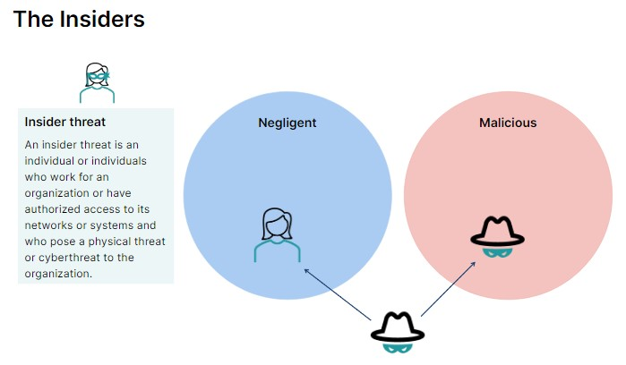
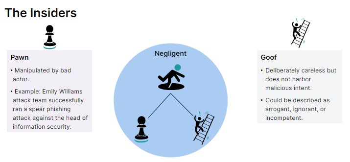
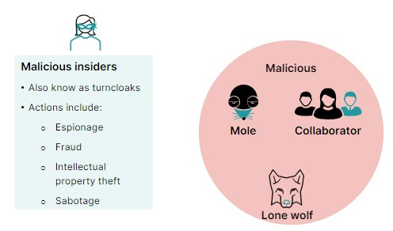

## Social Engineering 👥🔐

Social engineering refers to all techniques aimed at talking a target into revealing specific information or performing a specific action for illegitimate reasons. According to a study from CompTIA, human error accounts for 52 percent of the root causes of security breaches.

### Phishing 🎣

Phishing attacks use fake emails or messages to lure victims into clicking malicious links or attachments.

### Pretexting 🕵️‍♂️

Pretexting involves attackers crafting a believable story, such as posing as tech support, to gain the victim's trust and steal information.

### Baiting 🪛

Baiting is a social engineering tactic that uses deception to lure victims into compromising their own security or that of their organization. Cybercriminals set traps with enticing offers, waiting for victims to take the bait and get hooked.

### Quid Pro Quo 🔄

Quid pro quo (Latin for "something for something") is a social engineering tactic where an attacker offers something desirable to a victim in exchange for something valuable to them.

### Tailgating 🚪

Tailgating involves a person sneaking into a secure location by following someone authorized.

### Watering Hole 🌊

Watering hole attacks involve infecting websites that are commonly visited by the victim to steal information.

### Scareware 😱💻

Scareware uses fake threats to pressure victims into downloading useless or malicious security software.

### Smishing/Vishing 📲🗣️

Smishing refers to phishing attacks done via SMS, while vishing refers to phishing attacks conducted through voice calls.

## Insider Threat 👤🔒

An insider threat is an individual or individuals who work for an organization or have authorized access to its networks or systems and who pose a physical threat or cyberthreat to the organization.

### Negligent Insider 🤷‍♂️

A negligent insider is an insider who unintentionally causes harm by disregarding security protocols or making errors that lead to security breaches.

### Malicious Insider 😈

A malicious insider is an insider who intentionally causes harm by exploiting their access privileges and engaging in malicious activities.

These insider types—mole, collaborator, and lone wolf—are all malicious insiders. Although a mole is not initially an insider, after a successful social engineering attack (like the Emily Williams attack), the actor gains access to the network and becomes an insider. The actor does not become a mole until after gaining access to the network. Pawn and goof are both negligent insiders that third-party outsiders use to breach the network.

## Cyber Fraud and Cyber Scams 💻🕵️‍♂️

Cyber fraud and cyber scams are like two sides of the same coin - both involve online trickery for criminal gain.

### Cyber Fraud 💰

Cyber fraud refers to the illegal act itself, such as stealing credit card information online.

### Cyber Scams 🎭

Cyber scams refer to the deception used to achieve cyber fraud, such as phishing emails tricking victims into revealing sensitive information.

Pharming is a two-step process that begins with an attacker installing malicious code on a victim's computer or server. That code sends the victim to a spoofed website, where they may be tricked into offering their personal data or login credentials for a website or online service.