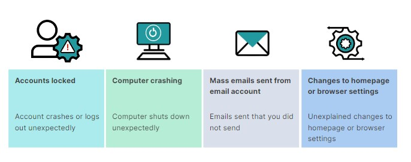
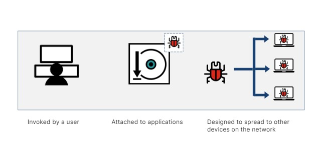
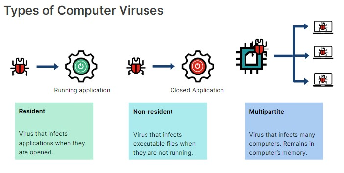
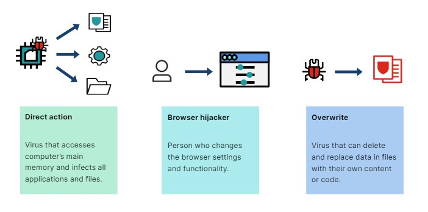
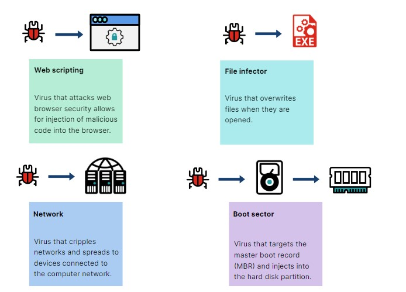
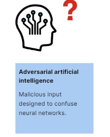

# Malware: The Creepy Crawlies of Cyber Threats 👾

Malware refers to malicious software nasties that can harm your computer. Here's a quick rundown of the creepy crawlies you want to avoid:

## Viruses & Worms 🦠

Viruses and worms are self-copying programs that spread like illness, infecting your device and sometimes others on the network.

## Trojans 🎭

Trojans are deceptive disguises hiding malicious intent. They trick you into installing them, then steal data or disrupt your system.

## Ransomware 💰🔒

Ransomware acts like digital kidnappers! They encrypt your files, hold them hostage, and demand a ransom for their release.

## Spyware 👀

Spyware acts like sneaky spies that steal your information like passwords and browsing history without you even knowing.

## Adware 🚫

Adware, while not exactly evil, is annoying for sure. It floods you with unwanted ads and pop-ups.

## Rootkits & Bootkits 🗝️

Rootkits and bootkits are deeply hidden nasties that give attackers complete control over your system. Imagine them like secret keys granting full access.

## Fileless Malware 💻

Fileless malware is cunning in nature. It uses legitimate tools for malicious purposes, making them hard to detect.

## Cryptojacking ⛏️💰

Cryptojacking steals your computer's power to generate cryptocurrency for someone else. It's like having your computer work for free!

## Types of Viruses 🦠

There are different types of viruses that can infect your system, including:

- Macro viruses
- Boot sector viruses
- File and program viruses
- Multipartite viruses
- Polymorphic viruses

## Attack Vector & Attack Surface 🔒🖥️

The difference between an attack vector, attack surface, and threat vector:

- **Attack Vector**: A method of gaining unauthorized access to a network or computer system.

- **Attack Surface**: The total number of attack vectors an attacker can use to manipulate a network or computer system or extract data.

