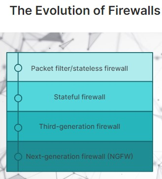
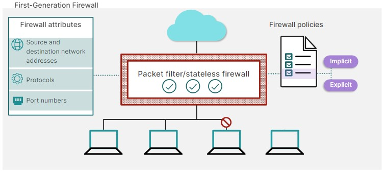
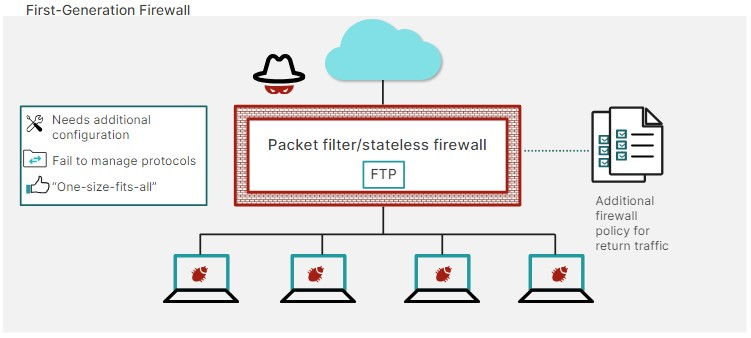
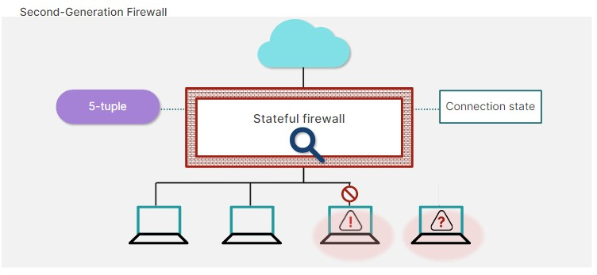

# Firewalls: Guardians of Your Network 🔥🔒

Firewalls are digital security systems that monitor and control incoming and outgoing network traffic.

#### Implicit Policy

An implicit firewall policy is a policy applied if no other match is found in the firewall policy list.

#### Explicit Policy

An explicit firewall policy is a policy created to specify if the traffic is allowed or denied.

## Types of Firewalls:

Firewalls come in various flavors, each with its strengths and purposes. Here's a breakdown of the common types:

1. Packet Filtering Firewalls: These basic firewalls inspect individual data packets (like tiny envelopes carrying information) traveling across the network. Based on predefined rules (allow/deny), they filter out unwanted traffic.

2. Stateful Firewalls: These advanced firewalls not only inspect individual packets but also analyze the "conversation" between devices. They track the connection state, allowing legitimate communication to flow while blocking unauthorized attempts.

3. Proxy Firewalls: These firewalls act as intermediaries between your device and the internet. All traffic is routed through the proxy, which filters and sanitizes the data before forwarding it.

4. Application Level Firewalls (ALFs): These intelligent firewalls monitor and filter traffic based on specific applications and their protocols. They can restrict specific functionalities within applications, adding an extra layer of security.

5. Next-Generation Firewalls (NGFWs): These powerhouse firewalls combine traditional firewall functionalities with advanced features like deep packet inspection, intrusion detection/prevention systems (IDS/IPS), and malware scanning.

Firewall Classifications:

Firewalls can also be classified based on their deployment:

- Hardware Firewalls: Dedicated physical devices installed at network entry/exit points, offering robust protection for large networks.
- Software Firewalls: Programs installed on individual devices, providing a layer of security for personal computers and mobile phones.
- Cloud-Based Firewalls: Security services delivered via the cloud, offering scalable and centralized firewall protection.

Why Use a Firewall?

Firewalls offer a crucial line of defense against various cyber threats:

- Unauthorized Access: They prevent unauthorized users, devices, or applications from accessing your network.
- Malware Intrusion: They block malware-infected traffic, helping to prevent viruses, worms, and other malicious software from infiltrating your system.
- Data Breaches: They can help regulate data flow, reducing the risk of sensitive information leaks.
- Denial-of-Service (DoS) Attacks: Some firewalls can mitigate DoS attacks by filtering out excessive traffic.

Firewall Limitations:

It's important to understand that firewalls are not foolproof. Here's what they can't necessarily do:

- Block All Threats: New and sophisticated threats might bypass traditional firewall rules.
- Protect Against Social Engineering: Firewalls can't defend against tactics that trick users into giving away information or clicking malicious links.
- Secure Unencrypted Traffic: Firewalls typically inspect the headers of data packets, not the content itself. Unencrypted traffic might carry hidden threats.

## 5-Tuple

5-tuple refers to the source IP address and port number, destination IP address and port number, and the protocol in use. It characterizes and allows tracking of a TCP/IP connection.

## Sandbox

A sandbox is a safe playground for risky code. It isolates it from your system to test untrusted stuff (like emails or files) without causing harm. 

## Virtual Machine (VM)

A virtual machine is an entire computer system within a program. It's like a whole separate apartment within your computer, where you can run different operating systems or isolate applications.