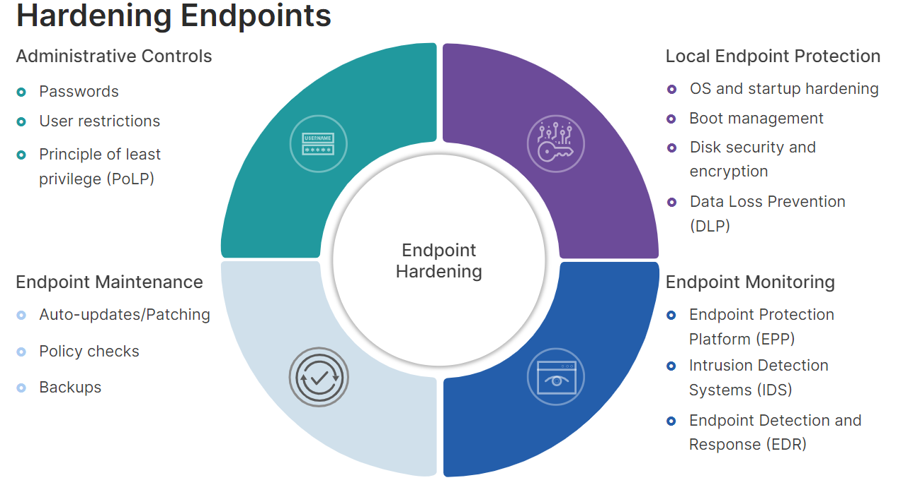

# Endpoint Hardening 🔒

Endpoint hardening refers to the process of strengthening the security of devices like laptops, desktops, smartphones, and tablets to minimize the risk of cyberattacks. Here are some key practices for endpoint hardening:

1. **Keep software up-to-date with security patches.** 🔄
2. **Use strong passwords and multi-factor authentication (MFA).** 🔐
3. **Give users only the access they need (least privilege).** 👥
4. **Use firewalls, antivirus, and consider app whitelisting.** 🛡️
5. **Encrypt sensitive data.** 📜
6. **Secure devices physically (passwords, location, locks).** 🔒
7. **Back up data regularly.** 💾
8. **Train users to be cyber aware.** 🚀

## Full Disk Encryption (FDE) 🔐

FDE stands for Full Disk Encryption. It's a security technology that encrypts the entire contents of a storage device, such as a hard disk drive (HDD) or solid-state drive (SSD). This encryption scrambles the data on the drive, making it unreadable to anyone who doesn't possess the decryption key.

Here's a breakdown of FDE's functionality:

- Encryption at Rest: When data is stored on the disk, FDE encrypts it before writing it. This ensures that even if someone gains physical access to the device, they cannot access the data without the decryption key.

## Self-Encrypting Device (SED) 🔒

A self-encrypting device (SED) is a storage device, typically a hard disk drive (HDD) or solid-state drive (SSD), that has built-in hardware encryption capabilities. This means the data on the device is automatically encrypted and decrypted without requiring any software installation or user intervention on the operating system.

## Data Loss Prevention (DLP) 🛡️

DLP stands for Data Loss Prevention. It's a set of tools and processes used to identify, monitor, and control the flow of sensitive data within an organization. The goal of DLP is to prevent unauthorized data exfiltration (leaking out) or accidental data loss.

By implementing endpoint hardening practices, utilizing FDE or SED, and implementing DLP measures, organizations can enhance the security of their devices, protect sensitive data, and mitigate the risk of cyberattacks.

