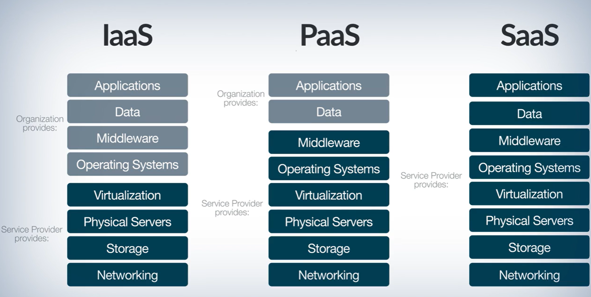

## Cloud Services ☁️💻

Cloud services let you rent computing resources over the internet, like electricity instead of buying a power plant.

### Types of Cloud Services (How much control do you have?) 🧩

1. IaaS (Infrastructure as a Service): Rent the building blocks (virtual servers, storage, networking) and manage everything yourself. Think of it as renting Legos, where you have more control but also more responsibility.

2. PaaS (Platform as a Service): Rent a platform to build and deploy your applications on. PaaS provides pre-configured environments, making it easier to use compared to IaaS. Think of it as renting pre-fab building materials, where you have less control but greater convenience.

3. SaaS (Software as a Service): Rent ready-made applications that you access over the internet. SaaS offers the easiest and most user-friendly experience, but with the least control. Think of it as renting an apartment with furniture, where you can use the software without worrying about infrastructure or maintenance.

### Cloud Providers (The Big Three) 🌐🔥

1. Amazon Web Services (AWS): AWS is a giant in the cloud computing market, offering a wide range of services and extensive global infrastructure.

2. Microsoft Azure: Azure provides strong integration with other Microsoft products and services, making it a popular choice for organizations already using Microsoft technologies.

3. Google Cloud Platform (GCP): GCP is known for competitive pricing and expertise in big data and machine learning. It offers a comprehensive set of cloud services and tools.

