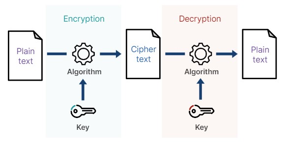
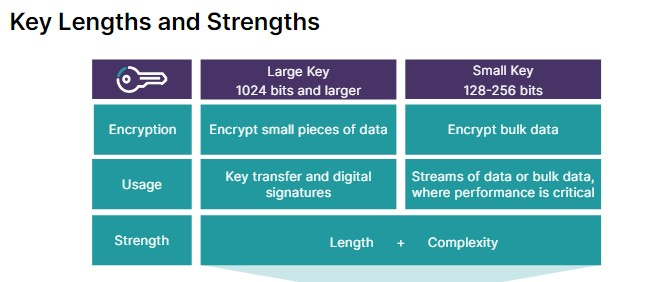
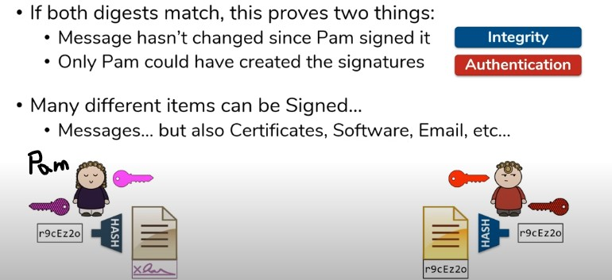
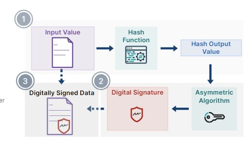
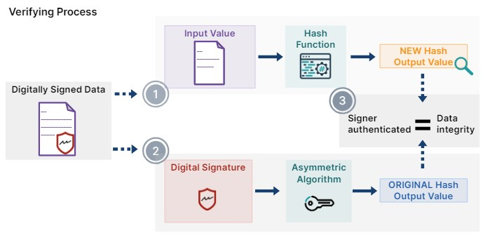
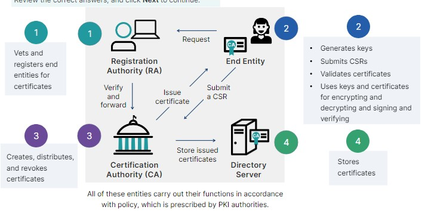

# Cryptography and the Public Key Infrastructure

🔐 Cryptography

Cryptography is the design of algorithms for encryption and decryption. It involves converting data into a meaningless form through encryption, and translating encrypted data back into its original text through decryption. The main goal of cryptography is to secure computer networks, online systems, and digital data. It is a concept whose endgame is to keep vital information that is subject to potential data breaches safe and confidential.

🖋️ Digital Signature

📜 Non-repudiation

Ciphers: A secret or disguised way of writing a code 

Ciphers (encryption methods) come in two main flavors:

- By transformation: How they change the data.
  - Substitution: Swap characters (Caesar cipher, etc.).
  - Transposition: Rearrange characters (columnar transposition, etc.).

- By key usage: How many keys are involved.
  - Symmetric: One shared key for encryption and decryption (AES, DES).
  - Asymmetric: Public key for encryption, private key for decryption (RSA).

There's also a distinction between:

- Block ciphers: Work on chunks of data (AES).
- Stream ciphers: Work on a continuous stream of data (RC4).

📜 Classical Ciphers

Simpler, often manual techniques (Caesar Cipher, Vigenere Cipher)
Less secure, easier to crack
Examples: Substitution (swap letters), Transposition (rearrange letters)

🔒 Modern Ciphers

Complex algorithms using computers
Much stronger security, harder to crack
Examples: AES (symmetric), RSA (asymmetric), SHA-256 (hashing)

🔒 One-time Pad (OTP)

A one-time pad is an encryption technique that uses a randomly generated key to encrypt and decrypt messages. It is considered to be a perfectly secure encryption method if used correctly.

💡 Stream Ciphers

Work on data bit-by-bit.
Use a random-like keystream for encryption.
Faster for some tasks, error only affects nearby bits.
Weaker security, keystream reuse is critical.
Examples: RC4 (insecure), Salsa20 (modern).

💡 Block Ciphers

Work on fixed-size data blocks.
More secure, especially for large messages.
Simpler design, error can corrupt entire block.
Modes needed for secure use, can be slower.
Examples: AES (standard), DES (weaker), 3DES (less secure).

## Keys and Cryptographic Algorithms

🔑 Digital Key

In cryptography, a digital key is a value, which can be expressed alphanumerically, that is used to perform cryptographic operations.

✍️ Digital Signature

🔒 Message Authentication Code (MAC)

🔐 Encryption

- Flow of information between two devices
- Bulk stationary data
- Small piece of data, such as a digital key

🔑 Key Length and Strength

The size of public keys is often 1024, 2048, or larger.

Key stretching is a technique used to make weak passwords more secure. It makes it much more time-consuming for an attacker to crack a password by adding computational complexity.

bcrypt & PBKDF2: These are hashing functions used to securely store passwords. They add a random "salt" to each password before hashing, making pre-computed attacks (rainbow tables) useless.

💡 Symmetric Algorithms

Symmetric algorithms, also known as secret-key algorithms, rely on a single shared secret key for both encryption and decryption. There are two main types of symmetric algorithms:

🔒 Block Ciphers

Block ciphers work by encrypting fixed-size blocks of data individually using the secret key. Popular examples include:

- AES (Advanced Encryption Standard)
- DES (Data Encryption Standard)

🔒 Stream Ciphers

Stream ciphers operate on a continuous stream of data, encrypting one bit at a time using a keystream derived from the secret key. An example is RC4 (Rivest Cipher 4).

💡 Asymmetric Algorithms

Asymmetric algorithms, also known as public-key algorithms, use a pair of keys: a public key for encryption and a private key for decryption. Examples include:

- RSA (Rivest-Shamir-Adleman)
- DSA (Digital Signature Algorithm)
- DH (Diffie-Hellman)
- ECC (Elliptic Curve Cryptography)
- ElGamal

⚡️ Symmetric Encryption (Shared Secret)

Symmetric encryption relies on a shared secret key for both encryption and decryption. It is fast and efficient for large data.

⚡️ Asymmetric Encryption (Public & Private Keys)

Asymmetric encryption uses a public key for encryption and a private key for decryption. It offers features like digital signatures for verification but is slower than symmetric encryption.

🔒 Symmetric Algorithms (Shared Secret Key)

- DES (Data Encryption Standard)
- 3DES (Triple DES)
- AES (Advanced Encryption Standard)
- RC4 (Rivest Cipher 4)

🔑 Asymmetric Algorithms (Public & Private Keys)

- RSA (Rivest-Shamir-Adleman)
- DSA (Digital Signature Algorithm)
- DH (Diffie-Hellman)
- ECC (Elliptic Curve Cryptography)
- ElGamal

# Hashing and Digital Signature

🔒 Hashing

Hashing is the process of converting data of an arbitrary size to a unique value of a fixed size.

💡 Digital Signatures

Digital signatures ensure:

- Data integrity
- Authentication of the signer
- Non-repudiation

🖋️ Signing Process

🔍 Verifying Process

🔒 Hashing Functions

Common hash functions include:

- Message Digest Five (MD5) and MD6
- Secure Hashing Algorithm One (SHA-1), SHA-2, and SHA-3
  - SHA-2 includes SHA-224, SHA-256, SHA-384, and SHA-512
  - SHA-3 with various output lengths
- Microsoft LANMAN and NT LAN Manager (NTLM) algorithm
- HAVEL and RIPEMD

🛡️ Common Attacks Against Hashing

1. Brute-force attack: This involves trying every possible password combination until the correct hash is found. Strong hashing algorithms and longer hashes make brute-forcing much more difficult.

2. Rainbow table attack: Rainbow tables are pre-computed tables that map possible passwords to their corresponding hashes. Attackers can use these tables to quickly reverse a hash and obtain the original password. The effectiveness of this attack depends on the availability of pre-computed rainbow tables for the specific hashing algorithm and password length used.

🔐 Public Key Infrastructure (PKI)

Public key infrastructure (PKI) is an ecosystem comprised of policies, procedures, software, and hardware needed to create, distribute, store, use, and revoke digital certificates.

Digital certificates are like online IDs verified by a trusted source (Certificate Authority - CA). Certificate Revocation Lists (CRLs) are blacklists for revoked certificates. PKI ensures that everyone uses the same format for these IDs, similar to passport formats. This system helps verify who you're talking to online.

