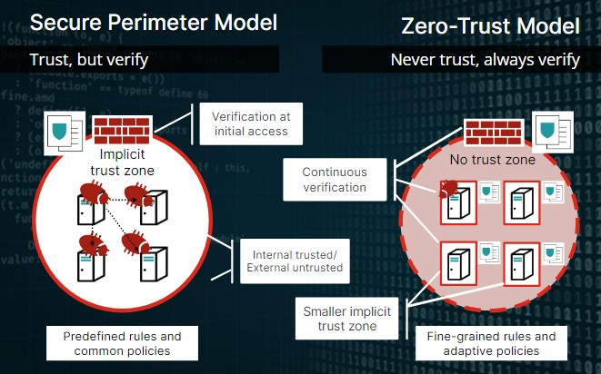
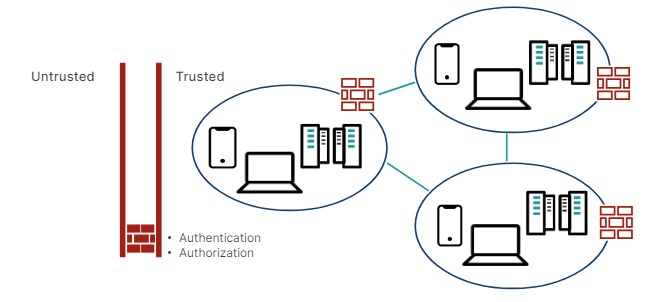
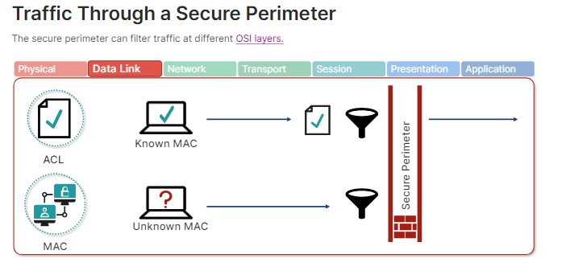
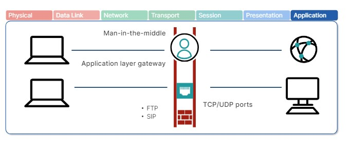
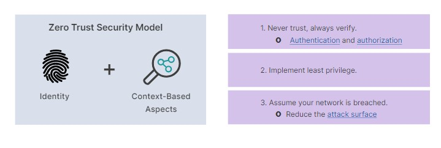
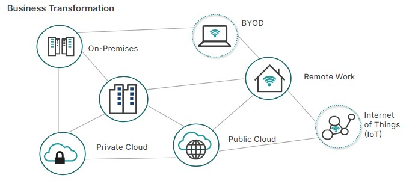
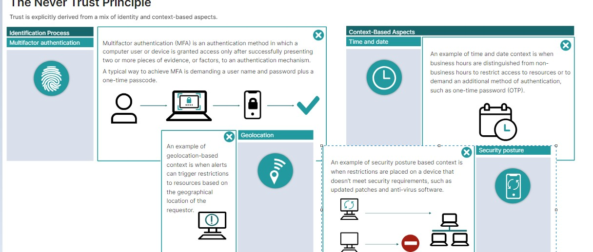
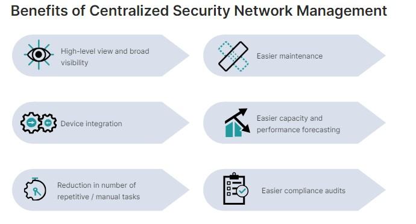
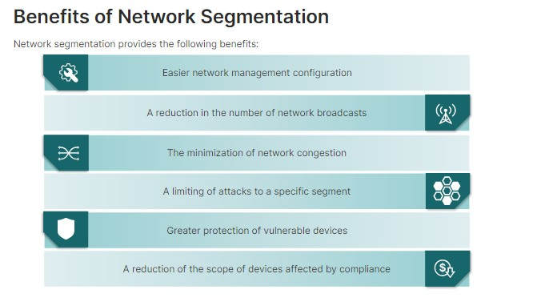

# Secure Network

🔒 Network Security

Network security is composed of configurations and rules implemented on devices and systems in the network. These rules ensure the integrity, privacy, and usefulness of the network, covering both the hardware and software that make the network run.

💡 Network Defense Models

There are two different philosophies for securing computer networks:

1. Secure Perimeter: Big walls and a locked gate (easy to set up, but anyone inside can roam free).
2. Zero Trust: ID check at every door (more work to set up, but everyone is verified every time).

🚧 Secure Perimeter

A secure perimeter is a form of protection that consists of devices or techniques added to the edge of a managed network.

🔒 Access Control List (ACL)

An Access Control List (ACL) is a security mechanism used in computer networking to control access to a network resource. It acts like a set of rules that determines whether to allow or deny traffic based on various criteria.

🚦 Traffic through Secure Perimeter

1. DataLink Layer Filtering
   

2. Transport Layer Filtering (based on Packets)
   

3. Transport Layer Filtering with NAT (Network Address Translation)
   

⚠️ Limitations of Secure Perimeter

🔒 Zero Trust

Zero Trust is an approach where trust must be explicitly derived from a mix of identity-based and context-based aspects.

🏢 Evolution of Network Security Architecture

Secure Perimeter ➡️ Zero Trust

💼 Business Transformation

☁️ Public Cloud

Like renting an apartment: Shared resources, easy access, pay-per-use.
Pros: Cost-effective, scalable, wide range of services.
Cons: Security concerns, vendor lock-in, less control.

🏢 Private Cloud

Like having your own house: Dedicated resources, high security, customizable.
Pros: More secure, customizable.
Cons: Expensive, less scalable, requires expertise to manage.

#### Centralized Security Management System (CSMS)

A Centralized Security Management System (CSMS) is a software solution that allows you to manage and monitor the security of your entire network from a single, unified platform. It acts as a central hub for various security tools and provides a consolidated view of your security posture.

#### Data Fabric

Data fabric is like a high-speed railway system for your data. It breaks down data silos (isolated data pockets) and connects all your data sources. This lets you access and analyze information easily, regardless of where it's stored.

Imagine a library with books scattered everywhere. Data fabric organizes those books into a central catalog and creates a network of trains (data pipelines) to deliver them quickly whenever you need them.

🚂📚 A tapestry of connecting information is Data fabric.

#### Data Silo

A data silo is a collection of data that is isolated from the rest of an organization's data. It's like having a bunch of independent mini-libraries within a larger library system, each with its own rules and restrictions on access and use.

#### Network Segmentation

Network segmentation is an architectural approach that divides a network into multiple segments or subnets, each acting as its own small network.

- Underlying network: The physical cables, switches, routers, etc. that carry data traffic. Think of it as the highway.
- Virtual network: A software-defined layer on top of the physical network, creating isolated sections like lanes on a highway. Offers security, flexibility, and efficient resource use.

A DMZ (demilitarized zone) is indeed a network facing the internet. 

A CAM table, also known as a Content Addressable Memory table or MAC address table, plays a crucial role in how network switches operate. 

- Normal MAC Flooding: Lots of devices connect, switch gets overwhelmed with addresses. Network slows down.
- MAC Flooding Attack: Attacker spams fake addresses to overload the switch.
- Result: Network grinds to a halt (DoS attack) and sensitive data might be exposed.
- Spoofing: In the context of computer security, spoofing refers to disguising your identity.
- MAC spoofing does involve using a fake MAC address. 
- MAC spoofing is the replacement of a legitimate MAC address with a fake address.

Spoofing

Spoofing is a threat during which the attacker impersonates an authorized device or user to steal data, spread malware, or bypass access control systems. The attacker is capable of spoofing any unique user or system identifier, like a MAC or IP address.

#### Common Network Threats

Types of DoS Attacks:

Flood Attacks (Connectionless Traffic):

- Smurf Attack: Spoofs victim's IP to send ICMP packets, overwhelming the victim with replies from other devices. 🌩️
- Fraggle Attack: Spoofs victim and sends UDP packets to a router's broadcast address, flooding the victim with traffic. 🌊

Protocol Attacks (Targeting Servers, Proxies, Firewalls):

- SYN Flood: Exploits TCP handshake by sending incomplete connections (SYN packets), exhausting server resources. ⚡
- Christmas Tree Attack: Sends TCP packets with specific flags (FIN, URG, PSH), requiring more processing and potentially crashing devices. 🎄

Packet Fragmentation Attacks:

- Ping of Death: Sends malformed oversized packets that crash the target device upon reassembly. 💥
- Teardrop Attack: Sends overlapping and oversized fragmented packets that crash the target device during reassembly. 💧

Other DoS Attacks:

- Permanent DoS (PDoS): Exploits vulnerabilities to replace device firmware, rendering it unusable. 🛡️
- Fork Bomb: Exploits the "fork" system call to rapidly replicate processes, consuming resources and crashing the system. 💣

Stay vigilant and protect your network from these threats! 🚀