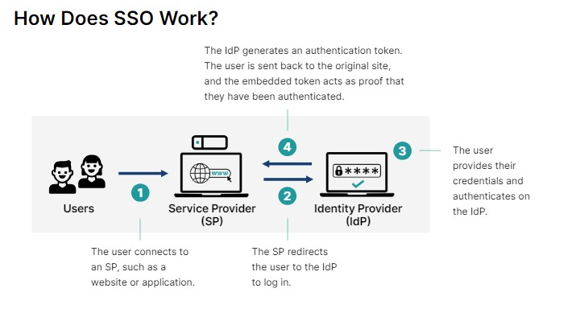
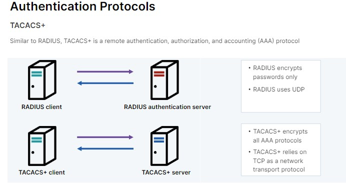
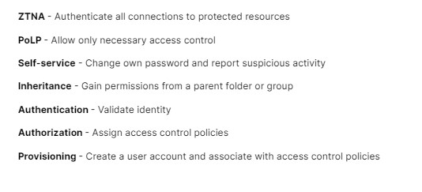

# Authentication and Access Control 🔒

## Authentication Methods 🚀

Authentication factors play a crucial role in verifying the identity of entities, such as individuals, applications, or devices, in computer systems. Here are the most common authentication factors:

- **Inherence** 💪🔓: This factor relates to the inherent characteristics of an entity, such as biometric data (👆 fingerprint, 👁️ iris scan, 😃 facial recognition) or physiological features that are unique to the individual.

- **Possession** 💼🔐: Authentication based on possession involves something that the entity possesses, such as a physical token (💳 smart card, 🔑 USB key) or a mobile device that generates one-time passwords.

- **Knowledge** 🧠🔑: Knowledge-based authentication relies on information that only the entity should know, like a password, PIN, or answers to specific security questions.

- **Behavior** 🔄🔒: Behavior-based authentication analyzes the patterns and habits of an entity's actions, such as typing speed, mouse movements, or user preferences. Deviations from the established behavior might trigger additional authentication measures.

## Multi-Factor Authentication (MFA) 🔐

MFA stands for Multi-Factor Authentication. It is a security measure that provides an additional layer of protection by requiring users to provide multiple factors of authentication to verify their identity.

MFA typically combines two or more authentication factors, such as something you know, something you have, and something you are (inherence). By requiring multiple factors, MFA significantly reduces the risk of unauthorized access and enhances overall security.

## What is a Token? 🎟️

In general, a token is an object that represents something else, such as another object (either physical or virtual) or an abstract concept. In the context of computers and security, a token refers to an electronic verification mechanism used to prove identity or gain access to resources.

Tokens can be physical, like a smart card 💳 or a USB key 🔑, or virtual, such as a software token generated on a mobile device.

## SSO, IdP, and SP 🔄👥🏢

- **SSO (Single Sign-On)**: This refers to a user authentication system that allows a user to log in once and access multiple applications or services without needing to re-enter their credentials for each one. It provides a convenient and secure way to manage multiple logins.

- **IdP (Identity Provider)**: This is a central service that acts as the authority for user authentication. It houses user credentials and verifies a user's identity when they attempt to access a resource (application or service). Think of it as a trusted third-party that confirms your identity.

- **SP (Service Provider)**: This is any application or service that relies on an IdP for user authentication. When you try to access an SP using SSO, it redirects you to the IdP for login. Once authenticated by the IdP, the SP receives confirmation and grants you access to its resources. The SP trusts the IdP's verification process.

## Credentials and Authentication Frameworks 📜🔑

In the context of computers and security, credentials refer to electronic verification information used to prove your identity to a system. It's like a digital ID and password that allows you to access resources like computers, networks, applications, or websites.

Both **OAuth** and **SAML** are authorization frameworks.

- **OAuth**: This framework enables third-party applications to access user data (with their consent) on behalf of the user, without sharing their actual credentials. It provides a secure and controlled way for applications to interact with each other.

- **SAML (Security Assertion Markup Language)**: SAML is an XML-based framework used for exchanging authentication and authorization data between an IdP and an SP. It enables secure single sign-on and facilitates trust between different systems.

## How Does SSO Work? 🔄🔐

## Authentication Protocols 🔄🔒

- **RADIUS**: A RADIUS server is a networking protocol that provides centralized authentication, authorization, and accounting (AAA) management for users who connect and use a network service.

- **TACACS+**: TACACS+ is a remote AAA protocol that allows a remote access server to communicate with an authentication server to validate user access.

## Authentication Methods 🔄🔒

Authentication methods define the manner in which authentication takes place. They could also be described as protocols that set the rules for interaction and verification, which endpoints or systems use to communicate.

- **PAP (Password Authentication Protocol)**:

  - Function: Simple authentication method where the client (user device) sends its username and password in cleartext (unencrypted) across the network tothe server for verification.

- **CHAP (Challenge Handshake Authentication Protocol)**:

  - Function: This protocol provides a more secure authentication method by using a three-way handshake process. The server challenges the client with a random value, and the client responds with a hashed value using a shared secret. This avoids sending the password in plaintext.

- **Kerberos**:

  - Function: Kerberos is a network authentication protocol that uses symmetric key cryptography to provide strong authentication for client-server applications. It relies on a trusted third-party called the Key Distribution Center (KDC) to authenticate entities and securely distribute session keys.

- **LDAP (Lightweight Directory Access Protocol)**:

  - Function: LDAP is a protocol used to access and maintain directory information services over a network. It is often used for user authentication and authorization by querying directory servers, such as Active Directory.

- **SAML (Security Assertion Markup Language)**:

  - Function: SAML is an XML-based framework for exchanging authentication and authorization data between an identity provider (IdP) and a service provider (SP). It enables single sign-on (SSO) across different systems and applications.

- **OpenID Connect**:

  - Function: OpenID Connect is an authentication protocol built on top of OAuth 2.0. It provides identity information about the user and enables single sign-on (SSO) across multiple applications.

- **802.1X**:

  - Function: 802.1X is a framework for network authentication designed to secure access to wired and wireless LANs (Local Area Networks). It involves three main players:

    - Supplicant: The device (like a laptop or smartphone) requesting access to the network.
    - Authenticator: The network device (switch or access point) controlling access. This could be a wired switch port or a wireless access point (WAP).
    - Authentication Server: A central server that verifies user credentials using a specific protocol (often RADIUS).

These are just a few examples of authentication methods, and there are many more available depending on the specific requirements and security needs of an application or system.

