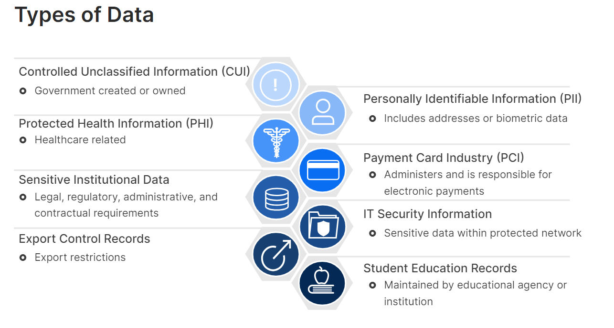

## Secure Data and Applications

**Data Security:**

- Data Encryption: Encrypting data at rest (stored on devices) and in transit (transferred over networks) scrambles it using a secret key. Only authorized users with the decryption key can access the original information. 🔐

- Data Access Controls: Implement access control mechanisms to restrict who can access specific data. This might involve user permissions, role-based access control (RBAC), or multi-factor authentication (MFA) for added security. 🚪

- Data Backup and Recovery: Regularly back up your data to a secure location to ensure you can restore it in case of accidental deletion, hardware failure, or cyberattacks. 🔄

- Data Loss Prevention (DLP): DLP systems can help prevent sensitive data from being accidentally or intentionally leaked through unauthorized channels like email or USB drives. 🚫📤

**Doxware and Leakware:**

Doxware and leakware are both nasty forms of ransomware that rely on extortion through threats of releasing sensitive data. Key Differences:

- **Doxware:** Focuses on stealing personal or embarrassing information about individuals. This could include private photos, videos, emails, financial records, or identification documents. The goal is to damage the victim's personal reputation or cause social humiliation. 😳

- **Leakware:** Targets a broader range of sensitive data. This might include business secrets, intellectual property, customer data, or internal communications. Leakware attacks can target individuals, businesses, or even government agencies. The attacker's motivation could be financial gain, but also causing disruption, damaging reputations, or achieving a specific ideological agenda. 🕵️‍♂️💼

**Cyber Extortion and Ransomware:**

Cyber extortion is a broad threat where attackers use fear to extort money. They might threaten to mess with your computer systems, leak your secrets, or ruin your reputation. Think of it as a digital bully.

Ransomware is a specific type of cyber extortion. It kidnaps your data by encrypting it, and you have to pay a ransom to get it back. Imagine a digital kidnapper holding your files hostage.