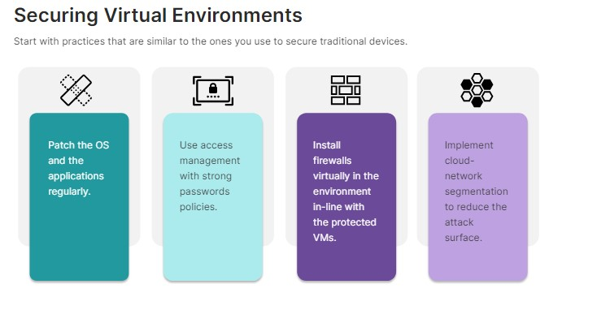
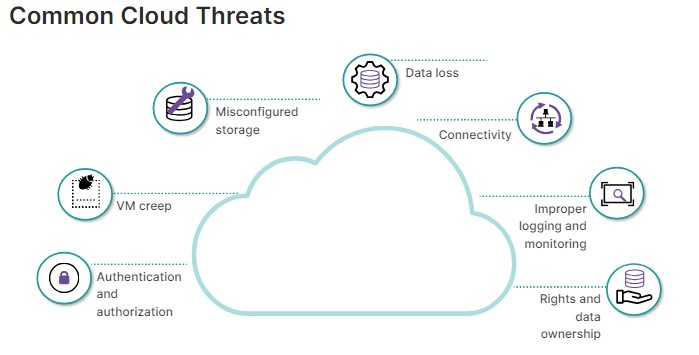

## Cloud Security and Virtualization

🔒 **Cloud Security:**

Refers to the practices and technologies used to protect data, applications, and infrastructure hosted in the cloud. Cloud security is the responsibility of both the cloud provider and the cloud customer (businesses or organizations using the cloud).

🖥️ **Virtualization:**

A technology that creates virtual machines (VMs) on a single physical server. These VMs can act like separate computers, running their own operating systems and applications. Virtualization is widely used in cloud computing because it allows for:

- Resource optimization: Multiple VMs can be run on a single server, maximizing hardware utilization.
- Scalability: Cloud providers can easily scale resources up or down by provisioning new VMs as needed.
- Isolation: VMs can be isolated from each other, enhancing security. However, proper security measures are still required within the virtualized environment.

A hypervisor, also known as a virtual machine monitor (VMM), is a software program that creates and manages virtual machines (VMs). It acts as an intermediary layer between the physical hardware of a computer system and the VMs it hosts.

🔒 

💥 **Virtualization Sprawl:**

Virtualization sprawl refers to the uncontrolled growth of virtual machines (VMs) within a virtualized environment. It happens when organizations create and deploy VMs without proper planning, management, or oversight. This can lead to several negative consequences.

🔓 **"VM Escape":**

"VM escape" refers to a critical security vulnerability in virtualization technology. It occurs when a program running inside a virtual machine (VM) manages to break free of the virtual environment and gain access to the underlying physical host system or other VMs on the same server.

🔍 **Data Remanence:**

Data remanence refers to the residual representation of digital data that remains even after attempts are made to erase or remove the data from storage media. It's a significant concern in cybersecurity because it means data you think you've deleted might still be recoverable.

Here are some practical examples of data erasure methods:

- Overwriting: Common method, good for most cases (HDDs & some SSDs) - Write random data over existing data multiple times.
- Degaussing: Scrambles data with a strong magnetic field (HDDs only).
- Crypto Erasure: Encrypts data with a key, making it unreadable even if recovered (HDDs & SSDs).
- Shredding: Physically destroys the storage media (most secure, all types).

🌩️ 

⚠️ **Cloud Threats:**

The biggest threat to public clouds and virtual environments is perceived to be errors in configuration, setup, and deployment. This is because virtual and cloud-based environments can be very complicated with multiple types of security layouts, network design, and infrastructure. Navigating and ensuring that all stages of a cloud-based environment are secure is an enormous task with very real impacts if done incorrectly.

🔒 **SecaaS:**

SecaaS stands for Security as a Service. It's a business model where a cloud provider delivers security solutions to an organization on a subscription basis, rather than the organization having to manage and maintain its own security infrastructure.

Here's a breakdown of SecaaS and its key characteristics:

- Security Solutions: SecaaS offers a wide range of security services, including:
  - Email Security: Protection against spam, phishing, and malware in email.
  - Endpoint Security: Secures devices like laptops, desktops, and mobile phones from malware and unauthorized access.
  - Web Security: Filters and blocks malicious websites and web traffic.
  - Firewalls: Monitors and controls incoming and outgoing network traffic.
  - Data Loss Prevention (DLP): Prevents sensitive data from being accidentally or intentionally leaked.
  - Intrusion Detection and Prevention (IDS/IPS): Detects and blocks unauthorized attempts to access computer systems or networks.
  - Identity and Access Management (IAM): Controls user access to applications and resources.

🌐 **SASE:**

SASE, which stands for Secure Access Service Edge, is a relatively new security framework that combines cloud-based security functions with networking capabilities. It aims to deliver a more streamlined and effective approach to securing access to applications and data in today's increasingly cloud-centric world.

🔍 **Forward Proxy:**

Acts on behalf of the client (you): A forward proxy sits between you (the client) and the internet. When you try to access a website, your request goes to the forward proxy first, instead of directly to the website.

🔙 **Reverse Proxy:**

Acts on behalf of the server: A reverse proxy sits in front of one or more web servers, acting as a gateway for incoming traffic. When a client requests a web page, the request goesto the reverse proxy first.

🔒 **CASB:**

A CASB acts as an intermediary between cloud service providers (CSPs) and cloud users within an organization. It enforces security policies and provides visibility and control over cloud data access.