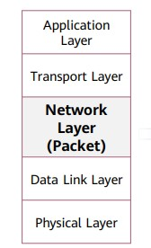
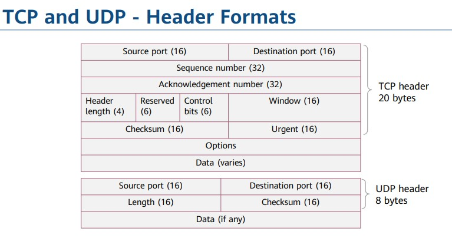
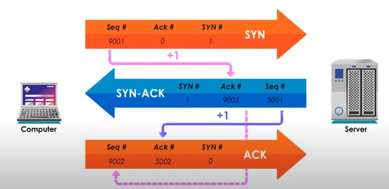
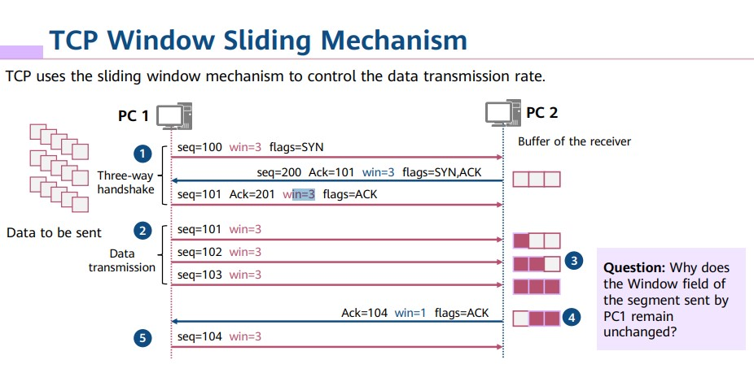

# Network Reference Model

## Origin of the Story - Applications 📱

Applications are used to meet various requirements of people, such as web page access, online gaming 🎮, and online video playback 🎥. Information is generated along with applications. Texts ✉️, pictures 📷, and videos 📺 are all information presentation modes. Data generated by most applications needs to be transmitted between devices.

## OSI Reference Model

### Layer 7: Application Layer 🖥️

Provides network services directly to applications like web browsers 🌐, email clients 📧, or file transfer tools 📂.
Examples: HTTP (web traffic), FTP (file transfer), SMTP (email).

### Layer 6: Presentation Layer 🎨

Focuses on data presentation and encryption/decryption. Handles data format conversion (e.g., ASCII to EBCDIC) and compression/decompression.

### Layer 5: Session Layer 🤝

Establishes, manages, and terminates sessions between communicating applications. Enables data exchange and synchronization between applications.

### Layer 4: Transport Layer 🚢

Provides reliable data transfer services between applications. Offers features like error checking ✅, flow control, and packet sequencing.
Common protocols: TCP (Transmission Control Protocol) and UDP (User Datagram Protocol).

### Layer 3: Network Layer 🌐

Responsible for logical addressing and routing packets across networks. Uses IP addresses (Internet Protocol) for identification and routing tables to determine the best path for packets.

### Layer 2: Data Link Layer 🔗

Deals with physical addressing (MAC addresses) and error detection on the physical link. Protocols: Ethernet, Wi-Fi (IEEE 802.11).

### Layer 1: Physical Layer 📡

Defines the physical characteristics of network transmission, such as cables, connectors, and signal transmission methods. Deals with the raw bits of data being transmitted over the physical medium.

## TCP/IP Reference Model

OSI Model (7 Layers):

- More theoretical, focusing on general communication functions.
- Provides a broader understanding of network communication principles.
- Not a perfect fit for all real-world protocols.

TCP/IP Model (4 Layers):

- Simpler and more practical, based on actual internet protocols.
- Easier to understand for troubleshooting network issues.
- Combines upper OSI layers (Session, Presentation, Application) into one.

## Application Layer

The application layer provides interfaces for application software so that applications can use network services. The application layer protocol designates transport layer protocols and ports. PDUs transmitted at the network layer are called data.

## Transport Layer

A transport layer protocol receives data from an application layer protocol, encapsulates the data with the corresponding transport layer protocol header, and helps establish an end-to-end (port-to-port) connection. PDUs transmitted at the transport layer are called segments.

## Network Layer

The transport layer is responsible for establishing connections between processes on hosts, and the network layer is responsible for transmitting data from one host to another. PDUs transmitted at the network layer are called packets. The network layer is also called the Internet layer. It sends packets from source hosts to destination hosts.

Functions of the network layer:

- Provides logical addresses for network devices.
- Routes and forwards data packets.
- Common network layer protocols include IPv4, IPv6, ICMP, and IGMP.

## Data Link Layer

The data link layer is located between the network layer and the physical layer and provides services for protocols such as IP and IPv6 at the network layer. PDUs transmitted at the data link layer are called frames. Ethernet is the most common data link layer protocol. The data link layer is located between the network layer and the physical layer.

- The data link layer provides intra-segment communication for the network layer.
- The functions of the data link layer include framing, physical addressing, and error control.
- Common data link layer protocols include Ethernet, PPPoE, and PPP.

## Physical Layer

After data arrives at the physical layer, the physical layer converts a digital signal into an optical signal, an electrical signal, or an electromagnetic wave signal based on the physical media. PDUs transmitted at the physical layer are called bitstreams. 💻