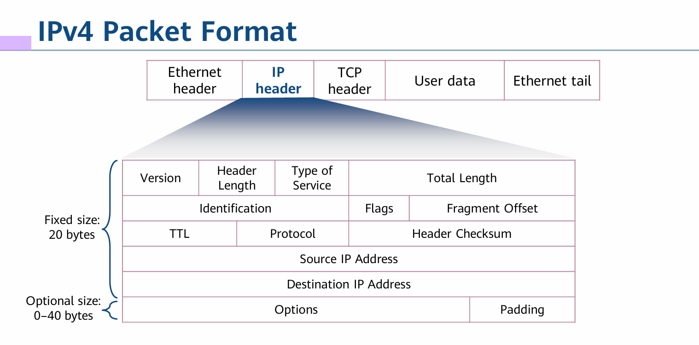

## Network Layer Protocols and IP Addressing

**IP (Internet Protocol)**

Internet Protocol is the name of a protocol file with small content. It defines and describes the format of IP packets. It provides logical addresses for devices at the network layer. 🌐

Ethernet Header: The Ethernet header contains information such as source and destination MAC addresses, and it encapsulates the IP packet. 🌐

IP Header: The IP header contains information such as source and destination IP addresses, and it encapsulates the TCP segment. 🌐

TCP Header: The TCP header contains information such as source and destination port numbers, sequence numbers, and acknowledgment numbers. It encapsulates the user data. 🌐

User Data: This represents the payload or actual data being transmitted, such as the contents of a web page, file, or any other application data. 🌐

**Fragmentation** 🧩
The process of dividing a packet into multiple fragments.

**Time to Live (TTL)** ⏳
The TTL field specifies the number of routers that a packet can pass through.

**Protocol** 📜
The Protocol field in the IP packet header identifies a protocol that will continue to process the packet.

An IPv4 address is 32 bits long. It is in dotted decimal notation.

**Public IP address** 🌍
An IP address is assigned by the Internet Assigned Numbers Authority (IANA), and this address allocation mode ensures that each IP address is unique on the Internet.

**Private IP address** 🔒
In practice, some networks do not need to connect to the Internet. For example, on a network of a lab in a college, IP addresses of devices need to avoid conflicting with each other only within the same network. In the IP address space, some IP addresses of class A, B, and C addresses are reserved for the preceding situations. These IP addresses are called private IP addresses.

- Class A: 10.0.0.0–10.255.255.255
- Class B: 172.16.0.0–172.31.255.255
- Class C: 192.168.0.0–192.168.255.255