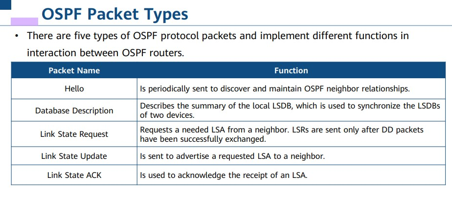

## OSPF Basics :computer:

:dart: **Distance-Vector Routing Protocol** :arrows_clockwise:

A router running a distance-vector routing protocol periodically floods routes. Each router on a network is clear only about where the destination is and how far the destination is, but unclear about the whole network topology. 

:zap: **Link-State Routing Protocol - LSA Flooding**

**Distance Vector (DV):**

- Simpler, less overhead
- Routers share info with neighbors (limited view)
- Slow to update (convergence) - "rumors" take time to spread
- No LSA flooding

**Link-State (LS):**

- More complex, higher overhead
- Routers share info about all links (flooding)
- Faster updates (convergence) - everyone gets the same map
- Uses LSA flooding to spread info

## Introduction to OSPF

OSPF is a typical link-state routing protocol and one of the widely used IGPs in the industry.

- OSPFv2, as defined in RFC 2328, is designed for IPv4. OSPFv3, as defined in RFC 2740, is designed for IPv6. Unless otherwise specified, OSPF in this presentation refers to OSPFv2.

- OSPF routers exchange link status information, but not routes. Link status information is key information for OSPF to perform topology and route calculation.

## OSPF Network Types

OSPF has four network types: broadcast, NBMA, P2MP, and P2P.

- `broadcast`: Specify OSPF broadcast network
- `nbma`: Specify OSPF NBMA network
- `p2mp`: Specify OSPF point-to-multipoint network
- `p2p`: Specify OSPF point-to-point network

## DR and BDR

**Designated Router (DR) and Backup Designated Router (BDR):**

To optimize OSPF neighbor relationships on an MA network, the OSPF protocol specifies three types of OSPF routers: DR, BDR, and DRother.

- Only the DR and BDR can establish adjacencies with other OSPF routers. DRothers do not establish OSPF adjacencies with one another, and their relationship is in the 2-way state.

## Multi-Area OSPF

OSPF introduces the concept of area. An OSPF domain is divided into multiple areas to support larger-scale networking.

- The OSPF multi-area design reduces the flooding scope of LSAs and effectively controls the impact of topology changes within an area, optimizing the network.
- Routes can be summarized at the area border to reduce the size of the routing table.

## Types of OSPF Routers

OSPF routers are classified into the following types based on their locations or functions:

- Internal router
- Area border router (ABR)
- Backbone router
- AS boundary router (ASBR)