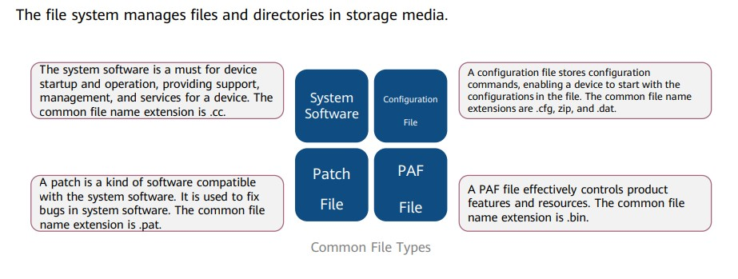
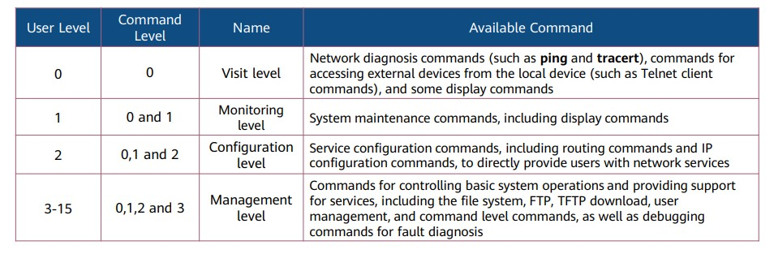

# Huawei VRP Basics 🌐📡

Versatile Routing Platform (VRP) is a general network operating system for Huawei network devices.

## File System 🗂️

## Device Management 🔧

There are two commonly used device management modes: CLI and web system.

### Web System 🌐

- The web system provides a graphical user interface (GUI) for easy device management and maintenance. However, it can only manage and maintain some, not all, device functions.
- The web system supports the HTTP and HTTPS login modes.

### CLI 💻

- The CLI requires users to use commands provided by a device to manage and maintain the device. This mode implements refined device management but requires users to be familiar with the commands.
- The CLI supports the console port, Telnet, and SSH login modes.

## VRP User Levels 👥🔒

VRP (Versatile Routing Platform) by Huawei utilizes a user level system to manage access and permissions for users interacting with network devices. This system ensures that only authorized users can perform specific configuration tasks, promoting network security and preventing unauthorized modifications.

Command levels are classified into visit, monitoring, configuration, and management, which are identified by the numbers 0, 1, 2, and 3, respectively.

## Command Line Shortcut Keys ⌨️🔑

System Shortcut Keys:

- CTRL_A: moves the cursor to the beginning of the current line.
- CTRL_B: moves the cursor one character to the left.
- CTRL_C: stops the running of the current command.
- CTRL_E: moves the cursor to the end of the current line.
- CTRL_X: deletes all characters on the left of the cursor.
- CTRL_Y: deletes the character at the cursor and all characters on the right of the cursor.
- CTRL_Z: returns to the user view.
- CTRL+]: terminates the current connection or switches to another connection.

## Common File System Operation Commands (1) 📂💻

1. Check the current directory.
   `<Huawei>pwd`
2. Display information about files in the current directory.
   `<Huawei>dir`
3. Display the content of a text file.
   `<Huawei>more`
4. Change the current working directory.
   `<Huawei>cd`
5. Create a directory.
   `<Huawei>mkdir`
6. Delete a directory.
   `<Huawei>rmdir`
7. Copy a file.
   `<Huawei>copy`
8. Move a file.
   `<Huawei>move`
9. Rename a file.
   `<Huawei>rename`
10. Delete a file.
    `<Huawei>delete`
11. Restore a deleted file.
    `<Huawei>undelete`
12. Permanently delete a file in the recycle bin.
    `<Huawei>reset recycle-bin`