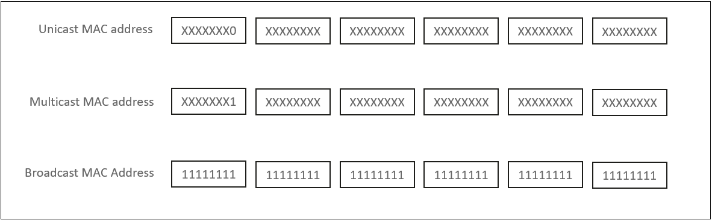

Ethernet Switching Basics
========================

Ethernet Protocols
------------------
🌐 Ethernet is the most common communication protocol standard used by existing local area networks (LANs). It defines the cable types and signal processing methods that are used on a LAN. An Ethernet network is a broadcast network built based on the carrier sense multiple access/collision detection (CSMA/CD) mechanism.

Ethernet NIC
------------
🖥️ A network interface card (NIC) is a key component that connects a network device (such as a computer, a switch, or a router) to an external network.

Ethernet Frame Format
---------------------
- The frames used by Ethernet technology are referred to as Ethernet frames.
- Ethernet frames are in two formats: Ethernet_II and IEEE 802.3

What Is a MAC Address?
----------------------
🔒 A media access control (MAC) address uniquely identifies a NIC on a network. Each NIC must have a globally unique MAC address.

- Each NIC has a number, that is, a MAC address, to identify itself, just as each person has an ID card number to themselves.
- A MAC address is 48 bits (6 bytes) in length.

MAC Address Composition and Classification
------------------------------------------
🔢 Represented in hexadecimal (e.g., 00:1A:2B:3C:4D:5E).
Composition:
- First 6 digits: Organizationally unique identifier (OUI) - Identify the manufacturer.
- Last 6 digits: Assigned by the manufacturer for specific devices or Company ID (CID)

Unicast Ethernet Frame
----------------------
📨 A unicast Ethernet frame is also called a unicast frame.
- The destination MAC address of a unicast frame is a unicast MAC address.

Broadcast Ethernet Frame
------------------------
📢 A broadcast Ethernet frame is also called a broadcast frame.
- The destination MAC address of a broadcast frame is a broadcast MAC address.

Multicast Ethernet Frame
------------------------
🌐 A multicast Ethernet frame is also called a multicast frame.
- The destination MAC address of a multicast frame is a unicast MAC address.

A switch processes the frames entering an interface over a transmission medium in three ways:
- Flooding
- Forwarding
- Discarding

